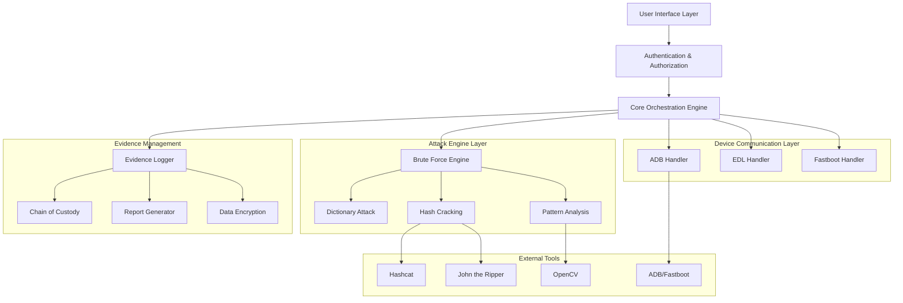

# Design Document

## Overview

Crack Droid is architected as a modular Python-based forensics toolkit with a design that separates device communication, attack engines, evidence management, and user interface concerns. The system supports multiple attack vectors through pluggable modules while maintaining strict evidence integrity

## Architecture



## Components and Interfaces

### Core Orchestration Engine
**Purpose:** Central coordinator managing forensic operations and workflow
**Key Classes:**
- `ForensicsOrchestrator`: Main workflow controller
- `DeviceManager`: Device detection and management
- `AttackCoordinator`: Attack strategy selection and execution
- `EvidenceManager`: Evidence collection and integrity management

**Interfaces:**
```python
class IForensicsEngine:
    def detect_devices(self) -> List[AndroidDevice]
    def analyze_device(self, device: AndroidDevice) -> DeviceProfile
    def execute_attack(self, strategy: AttackStrategy) -> AttackResult
    def generate_evidence_report(self, case_id: str) -> EvidenceReport
```

### Device Communication Layer
**ADB Handler:**
- Device detection via `adb devices`
- Lock type identification through system properties
- Simulated input injection for brute force
- File system access for rooted devices

**EDL Handler:**
- Emergency Download Mode detection
- Firehose loader communication
- NAND dump extraction
- Partition analysis

**Fastboot Handler:**
- Bootloader communication
- Recovery flashing capabilities
- Device state management

### Attack Engine Layer
**Brute Force Engine:**
- Multi-threaded attack coordination
- Lockout detection and delay handling
- Progress tracking and resumption
- Attack vector selection based on device capabilities

**Dictionary Attack Module:**
- Custom wordlist management
- Common PIN/pattern databases
- Hybrid attack strategies (dictionary + mask)
- Heuristic prioritization algorithms

**Pattern Analysis Module:**
- OpenCV-based visual pattern recognition
- Gesture.key file analysis
- Pattern space enumeration
- Visual debugging and verification

**Hash Cracking Module:**
- Hashcat integration for GPU acceleration
- John the Ripper fallback support
- Hash format detection and conversion
- Distributed cracking coordination

### Evidence Management System
**Evidence Logger:**
- Timestamped operation logging
- Cryptographic integrity verification
- Structured evidence collection
- Real-time audit trail generation

**Chain of Custody Manager:**
- Case ID validation and tracking
- Evidence handling documentation
- Access control and authorization
- Tamper detection mechanisms

**Report Generator:**
- JSON structured data export
- PDF formatted reports
- Evidence visualization
- Court-admissible documentation

## Data Models

### Device Profile
```python
@dataclass
class AndroidDevice:
    serial: str
    model: str
    brand: str
    android_version: str
    imei: Optional[str]
    usb_debugging: bool
    root_status: bool
    lock_type: LockType
    screen_timeout: int
    lockout_policy: LockoutPolicy
```

### Attack Strategy
```python
@dataclass
class AttackStrategy:
    strategy_type: AttackType
    target_device: AndroidDevice
    wordlists: List[str]
    mask_patterns: List[str]
    max_attempts: int
    delay_handling: DelayStrategy
    gpu_acceleration: bool
```

### Evidence Record
```python
@dataclass
class EvidenceRecord:
    case_id: str
    timestamp: datetime
    operation_type: str
    device_serial: str
    attempt_number: int
    result: str
    hash_verification: str
    chain_of_custody: List[CustodyEvent]
```

## Error Handling

### Device Communication Errors
- **ADB Connection Failures:** Automatic retry with exponential backoff
- **Device Disconnection:** Graceful session suspension and recovery
- **Permission Denied:** Clear error messaging with resolution steps
- **Timeout Handling:** Configurable timeout values with user notification

### Attack Engine Errors
- **Lockout Detection:** Automatic delay calculation and waiting
- **Resource Exhaustion:** Memory and CPU monitoring with throttling
- **Hash Cracking Failures:** Fallback to alternative cracking engines
- **Pattern Recognition Errors:** Manual verification prompts

### Evidence Integrity Errors
- **Hash Mismatch:** Immediate alert and evidence quarantine
- **Chain of Custody Breaks:** Audit trail reconstruction attempts
- **Encryption Failures:** Secure evidence disposal protocols
- **Report Generation Errors:** Partial report recovery mechanisms

### System-Level Error Handling
```python
class ForensicsException(Exception):
    def __init__(self, message: str, error_code: str, evidence_impact: bool):
        self.message = message
        self.error_code = error_code
        self.evidence_impact = evidence_impact
        self.timestamp = datetime.now()
        
    def log_error(self):
        # Log to evidence system with integrity preservation
        pass
```

## Testing Strategy

### Unit Testing
- **Device Communication Modules:** Mock ADB/EDL responses
- **Attack Engines:** Controlled test environments with known passwords
- **Evidence Management:** Hash verification and chain of custody validation
- **Cryptographic Functions:** Known answer tests and edge cases

### Integration Testing
- **End-to-End Workflows:** Complete forensic analysis simulations
- **Multi-Device Scenarios:** Concurrent device handling
- **Attack Strategy Combinations:** Hybrid attack method validation
- **Evidence Report Generation:** Full documentation pipeline testing

### Security Testing
- **Access Control Validation:** Role-based permission enforcement
- **Evidence Tampering Detection:** Integrity verification under attack
- **Encryption Strength:** Cryptographic implementation validation
- **Audit Trail Completeness:** Chain of custody gap detection

### Performance Testing
- **GPU Acceleration Benchmarks:** Hashcat performance optimization
- **Multi-threading Efficiency:** Concurrent attack coordination
- **Memory Usage Profiling:** Large wordlist and device handling
- **Network Communication Latency:** EDL and ADB response times

### Compliance Testing
- **Legal Requirement Validation:** Disclaimer and consent workflows
- **Evidence Standards Compliance:** Court-admissible report formats
- **Chain of Custody Integrity:** Forensic standard adherence
- **Access Control Auditing:** Role-based security validation

### Test Environment Setup
```python
class ForensicsTestEnvironment:
    def setup_test_devices(self):
        # Configure Android emulators with known lock screens
        pass
        
    def create_mock_evidence(self):
        # Generate test evidence with known hashes
        pass
        
    def validate_legal_compliance(self):
        # Verify disclaimer and consent mechanisms
        pass
```

The design emphasizes modularity, evidence integrity, and legal compliance while providing the technical capabilities needed for authorized Android device forensics. Each component is designed to be testable, maintainable, and extensible for future enhancements.